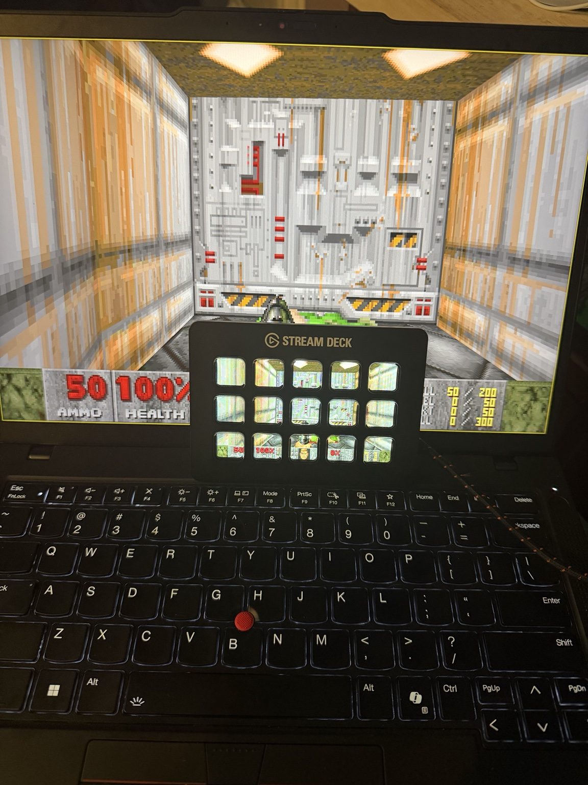

# DoomDeck

A project that allows UZDoom to display on and receive controls from an Elgato Stream Deck MK.2.

*Definitely not made with the assistance of ChatGPT because I have basically no knowledge of TypeScript or anything C based (why would I **EVER** do that?)*

<p align="center">
  
</p>

# Installation

## Requirements

- Windows
- Elgato Stream Deck software
- UZDoom
- Stream Deck (obviously...)

## Setup

1. Install the DoomDeck Stream Deck plugin.

2. Create a new Stream Deck profile dedicated to DoomDeck.

3. Fill **every key** on that profile with the **Counter** action from the plugin.

4. Copy `DoomDeckCapture.exe` into the same folder as `uzdoom.exe`.

5. On your normal Stream Deck profile, create a **Multi Action** containing:
   - Open `uzdoom.exe`
   - Delay **1000 ms**
   - Open `DoomDeckCapture.exe`

6. Open **Stream Deck Settings → Profiles** and set your DoomDeck profile as the **Application Profile** for `uzdoom.exe`.

7. Press your Multi Action button to launch the game.

When UZDoom opens, Stream Deck will automatically switch to your DoomDeck profile. Closing UZDoom will automatically return Stream Deck to your previous profile.

## Controls

DoomDeck uses the default ZDoom controls, with the exception of **Next Weapon**, which is bound to **E**, and **Previous Weapon**, which is bound to **Q**. Make sure to adjust your UZDoom controls accordingly.

The control layout is:

```text
┌─────────────────┬─────────────┬─────────────┬─────────────┬─────────────────┐
│ Previous Weapon │     Run     │    Fire     │     Use     │   Next Weapon   │
├─────────────────┼─────────────┼─────────────┼─────────────┼─────────────────┤
│       Map       │  Turn Left  │   Forward   │ Turn Right  │     Escape      │
├─────────────────┼─────────────┼─────────────┼─────────────┼─────────────────┤
│   Quick Save    │ Strafe Left │  Backward   │Strafe Right │   Quick Load    │
└─────────────────┴─────────────┴─────────────┴─────────────┴─────────────────┘
```
